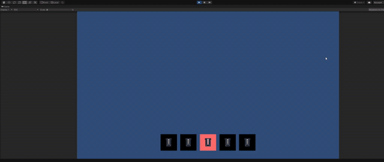

# Quick-Select--Unity
This is a script that gives a simple ui element of quick selection of objects with a color for selected and unselected

 
 
*How to use*
<ol>
  <li>Add the script in empty object in the scene</li>  
  <li>Add Ui with images and assign them to the array of items. <h1>Put them in order from element 0 to element n</h1></li>
  
  <li>Assign one color for the selected and unselected in the script</li>
  
  <li>play test</li>
</ol>
